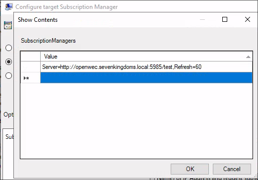
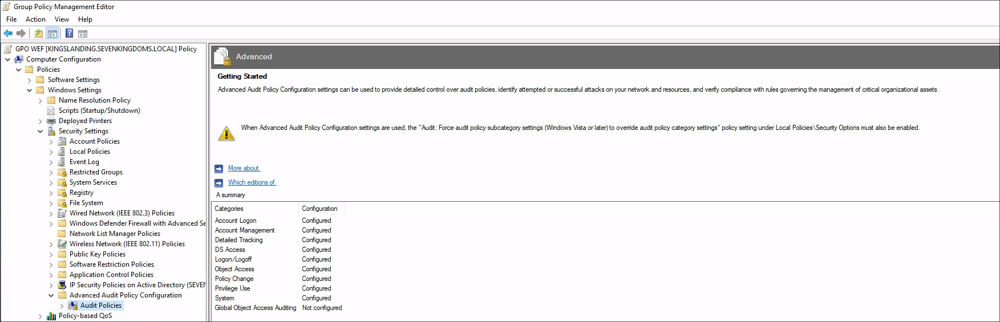
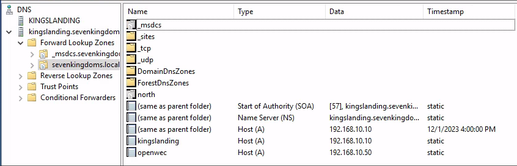
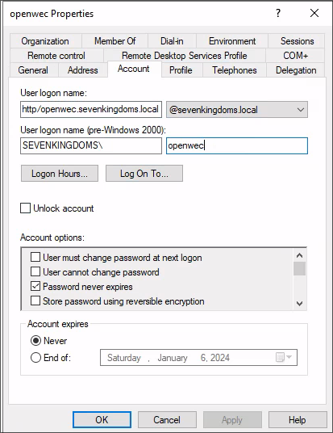

# Installation d'OpenWEC

## 1. Téléchargement d'OpenWEC

```bash
root@openwec:~# git clone https://github.com/cea-sec/openwec.git
root@openwec:~#  cd openwec
root@openwec:~#  cargo build --release
```

Une fois l'installation terminer on copie les fichier openwec et openwecd dans /usr/local/bin

```bash
root@openwec:~#  cp .target/release/openwecd /usr/local/bin
root@openwec:~#  cp .target/release/openwec /usr/local/bin
```

On vient ensuite créer un service systemd pour openwec:

```bash
systemctl edit openwec.service --full --force
```

```bash
[Unit]
Description=Windows Events Collector
After=network.target
[Service]
Type=simple
User=openwec
Restart=always
RestartSec=5s
ExecStart=/usr/local/bin/openwecd -c /etc/openwec/openwec.conf.toml
[Install]
WantedBy=multi-user.target
```

On doit créer un fichier pour les logs et pour la base de données en donnant les droits à l'utilisateur openwec:

```bash
# Dossier pour la base de données
root@openwec:~# mkdir /var/db/openwec
root@openwec:~# chown -R openwec:openwec /var/db/openwec

# Dossier pour la remonter des logs:
root@openwec:~# mkdir /openwec
root@openwec:~# chown -R openwec:openwec /openwec
```

## 2. Configuration du serveur OpenWEC

Fichier de configuration /etc/openwec.conf.toml:

``` bash
root@openwec:~# cat /etc/openwec.conf.toml 
# /etc/openwec.conf.toml par default
[server]
db_sync_interval = 5
flush_heartbeats_interval = 5
keytab = "/etc/fullwec.keytab"

[logging]
verbosity = "info"

[database]
type = "SQLite"
# You need to create /var/db/openwec yourself
path = "/var/db/openwec/db.sqlite"

[[collectors]]
hostname = "openwec.sevenkingdoms.local"
listen_address = "0.0.0.0"

[collectors.authentication]
type = "Kerberos"
service_principal_name = "http/openwec.sevenkingdoms.local@SEVENKINGDOMS.LOCAL"
```

### Initialisation de la database

```bash
root@openwec:~# openwec -c /etc/openwec.conf.toml db init
```

### Configuration de la subscription avec les règles de l'ANSSI

```bash
# Recupère les règles de l'ANSSI
wget -O anssi.xml https://raw.githubusercontent.com/ANSSI-FR/guide-journalisationmicrosoft/main/Standard_WEC_query.xml

# Crée la subscription
openwec -c /etc/openwec/openwec.conf.toml subscriptions new anssisubscription ./anssi.xml

# Configure la sortie des logs
openwec subscriptions edit anssi-subscription outputs add --format json files /openwec/

# Active la subscription
openwec subscriptions enable anssi-subscription
```

## 3. Configuration sur Windows

On reprends la GPO vue en cours sur le lien [suivant](https://github.com/pushou/pushou_public_pdf/blob/main/BUT/R5.cyber.11/installation_wef_policy_en_images.pdf)

On modifie le serveur dans EventForwarding:



Dans la configuration de l'accès aux logs on defini la valeur suivante:

```O:BAG:SYD:(A;;0xf0005;;;SY)(A;;0x5;;;BA)(A;;0x1;;;S-1-5-32-573)(A;;0x1;;;NS)```

Ensuite, il faut configurer les règles de l'ANSSI pour l'audit en suivant le lien [suivant](https://cyber.gouv.fr/publications/recommandations-de-securite-pour-la-journalisation-des-systemes-microsoft-windows-en)



Il faut faire la même configuration sur chaque DC.

### Configuration du DNS et de l'utilisateur openwec

On ajoute une entrée au DNS Windows de l'AD pour notre machine openwec.



On ajoute également un utilisateur openwec avec le user logon suivant (important pour kerberos):



Sur la machine du serveur OpenWEC il faut editer le fichier /etc/hosts

```bash
root@openwec:~# cat /etc/hosts
127.0.0.1 localhost
::1 localhost ip6-localhost ip6-loopback
ff02::1 ip6-allnodes
ff02::2 ip6-allrouters
192.168.10.50 openwec
192.168.10.10 kingslanding.sevenkingdoms.local kingslanding
192.168.10.11 winterfell.north.sevenkingdoms.local winterfell
192.168.10.12 meereen.essos.local meereen
```

### Kerberos

On relie le SPN à l'utilisateur openwec (Windows), exemple sur le domaine (sevenkingdoms.local) il faut le faire sur les 3 DC.

```powershell
C:\Users\vagrant>setspn -S http://openwec.sevenkingdoms.local openwec

#On verifie
C:\Users\vagrant>setspn -L openwec
Registered ServicePrincipalNames for CN=openwec,CN=Users,DC=sevenkingdoms,DC=local:
        http/openwec.sevenkingdoms.local
```

On génère la keytab:

```powershell
C:\Users\vagrant>ktpass -princ http/openwec.sevenkingdoms.local@SEVENKINGDOMS.LOCAL -mapuser openwec -crypto ALL -mapop set ptype KRB5_NT_PRINCIPAL -pass rootroot -target kingslanding.sevenkingdoms.local -kvno 0 -out c:\Users\vagrant\Desktop\dc1.keytab
Successfully mapped http/openwec.sevenkingdoms.local to openwec.
Password successfully set!
Key created.
Key created.
Key created.
Key created.
Key created.
Output keytab to c:\Users\vagrant\Desktop\dc1.keytab:
Keytab version: 0x502
keysize 79 http/openwec.sevenkingdoms.local@SEVENKINGDOMS.LOCAL ptype 1 (KRB5_NT_PRINCIPAL) vno 0 etype 0x1 (DES-CBC-CRC) keylength 8 (0xae5ee3d04692573d)
keysize 79 http/openwec.sevenkingdoms.local@SEVENKINGDOMS.LOCAL ptype 1 (KRB5_NT_PRINCIPAL) vno 0 etype 0x3 (DES-CBC-MD5) keylength 8 (0xae5ee3d04692573d)
keysize 87 http/openwec.sevenkingdoms.local@SEVENKINGDOMS.LOCAL ptype 1 (KRB5_NT_PRINCIPAL) vno 0 etype 0x17 (RC4-HMAC) keylength 16 (0xba5950caf1a379dd9e73592533d747d4)
keysize 103 http/openwec.sevenkingdoms.local@SEVENKINGDOMS.LOCAL ptype 1 (KRB5_NT_PRINCIPAL) vno 0 etype 0x12 (AES256-SHA1) keylength 32 (0x8190d33380e991b1cbdc0a2cccd86cf03a08ade69917347f2ea4ff955c2c0aba)
keysize 87 http/openwec.sevenkingdoms.local@SEVENKINGDOMS.LOCAL ptype 1 (KRB5_NT_PRINCIPAL) vno 0 etype 0x11 (AES128-SHA1) keylength 16 (0x0a6a9c3a28add595f0f63febb14a1143)
```

### Fusion des keytab sur le serveur

Après avoir générer les 3 keytabs sur les DC et récupérer sur le serveur, on peut les fusionner: 

On installe le paquet Kerberos:

```bash
apt install krb5-user
```

On lance l'utilitaire Kerberos pour les keytab:

```bash
root@openwec:~# ktutil
# On lit les 3 keytab
ktutil:  rkt dc1.keytab
ktutil:  rkt dc2.keytab
ktutil:  rkt dc3.keytab
# Affiche le contenu
ktutil:  l
slot KVNO Principal
---- ---- ---------------------------------------------------------------------
   1    0 http/openwec.sevenkingdoms.local@SEVENKINGDOMS.LOCAL
   2    0 http/openwec.sevenkingdoms.local@SEVENKINGDOMS.LOCAL
   3    0 http/openwec.sevenkingdoms.local@SEVENKINGDOMS.LOCAL
   4    0 http/openwec.sevenkingdoms.local@SEVENKINGDOMS.LOCAL
   5    0 http/openwec.sevenkingdoms.local@SEVENKINGDOMS.LOCAL
   6    0 http/openwec.north.sevenkingdoms.local@NORTH.SEVENKINGDOMS.LOCAL
   7    0 http/openwec.north.sevenkingdoms.local@NORTH.SEVENKINGDOMS.LOCAL
   8    0 http/openwec.north.sevenkingdoms.local@NORTH.SEVENKINGDOMS.LOCAL
   9    0 http/openwec.north.sevenkingdoms.local@NORTH.SEVENKINGDOMS.LOCAL
  10    0 http/openwec.north.sevenkingdoms.local@NORTH.SEVENKINGDOMS.LOCAL
  11    0     http/openwec.essos.local@ESSOS.LOCAL
  12    0     http/openwec.essos.local@ESSOS.LOCAL
  13    0     http/openwec.essos.local@ESSOS.LOCAL
  14    0     http/openwec.essos.local@ESSOS.LOCAL
  15    0     http/openwec.essos.local@ESSOS.LOCAL
# On créer la nouvelle keytab
ktutil:  wkt /etc/fullwec.keytab
```

Il faut ajouter les droits à l'utilisateur openwec sur la keytab:

```bash
root@openwec:~# chown -R openwec:openwec /etc/fullwec.keytab
```

## 4. Démarrage du serveur

On démarre le serveur avec le service systemd créée précedemment

```bash
root@openwec:~# systemctl start openwec
root@openwec:~# systemctl status openwec
* openwec.service - Windows Events Collector
     Loaded: loaded (/etc/systemd/system/openwec.service; enabled; vendor preset: enabled)
     Active: active (running) since Thu 2023-12-07 11:44:26 CET; 42s ago
   Main PID: 4865 (openwecd)
      Tasks: 6 (limit: 154025)
     Memory: 2.6M
        CPU: 20ms
     CGroup: /system.slice/openwec.service
             `-4865 /usr/local/bin/openwecd -c /etc/openwec/openwec.conf.toml

Dec 07 11:44:26 openwec systemd[1]: Started Windows Events Collector.
Dec 07 11:44:26 openwec openwecd[4865]: 2023-12-07T11:44:26.055247905+01:00 INFO server - Server settings: Server { db_sync_interval: Some(5), flush_heartbea>
Dec 07 11:44:26 openwec openwecd[4865]: 2023-12-07T11:44:26.055385808+01:00 INFO server::heartbeat - Heartbeat task started
Dec 07 11:44:26 openwec openwecd[4865]: 2023-12-07T11:44:26.055431926+01:00 INFO server::subscription - reload_subscriptions task started
Dec 07 11:44:26 openwec openwecd[4865]: 2023-12-07T11:44:26.055830855+01:00 INFO server - Server listenning on 0.0.0.0:5985
Dec 07 11:44:26 openwec openwecd[4865]: 2023-12-07T11:44:26.056659532+01:00 INFO server::subscription - Subscription F271FE17-18BE-4691-91F7-A1932BE7888A has>
Dec 07 11:44:26 openwec openwecd[4865]: 2023-12-07T11:44:26.056709627+01:00 INFO server::outputs::file - File output task started
```

On peut vérifier que des logs remontent bien:

```bash
root@openwec:~# ls /openwec/log/
192.168.10.10  192.168.10.11  192.168.10.12  192.168.10.22  192.168.10.23
```

On voit bien les 5 servers remontés dans le dossier log, on peut verifier le contenu dans un fichier pour le serveur 192.168.10.12 par exemple:

```bash
root@openwec:~# tail -f /openwec/log/192.168.10.12/MEEREEN@ESSOS.LOCAL/messages
```


Les logs remontent bien dans notre serveur OpenWEC.