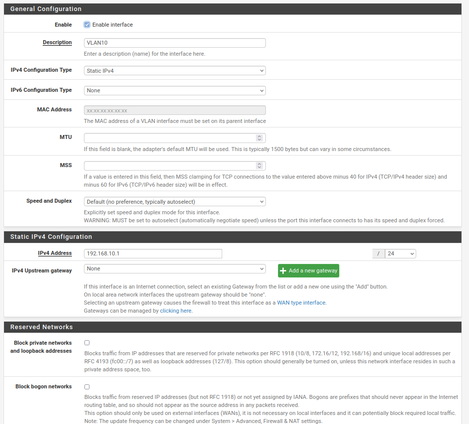

Valentin Tugot
# Installation GOAD sous proxmox

Après l'installation le schéma du réseau est le suivant:


Les différentes installations suivantes ont été effectués après l'installation de proxmox (version 7.2) sur un serveur de la salle.

## 1. Installation de pfSense

L'utilisation de pfSense permet d'avoir un pare-feu virtuel qui nous permet de gérer la connexion entre notre proxmox et l'environnement GOAD tout en ayant de la sécurité et différents services utiles tel que le DHCP ou le DNS.<br>
Le pare-feu pfSense permettra également d'accéder au machine de GOAD avec un accès OpenVPN.
<br>

Dans un premier temps il faut configurer 3 bridges sur le proxmox pour réaliser les différents réseau (WAN, LAN, VLAN10):


<br>

Une fois les bridges crée, il faut créer la VM avec pfSense.<br>
J'ai récupéré l'iso pfsense sur le site officiel, j'ai importé l'iso sur proxmox puis j'ai crée la VM.<br>
Afin d'accéder au pare-feu, on se connecte en SSH sur le proxmox en faisant un forward de l'IP du pfSense sur un port de ma machine locale avec la commande suivante:
```bash
ssh -L 8082:192.168.1.2:80 root@10.202.100.200
```

### Configuration des interfaces

Une fois la VM installé j'ai configuré les interfaces du pare-feu:
<br>
J'ai assigné chaque interface du pare-feu à un bridge du proxmox crée précédemment


Pour les interfaces, l'adressage est le suivant:
- WAN: 10.0.0.2/30
- LAN: 192.168.1.2/24
- VLAN10: 192.168.10.1/24

### Configuration du filtrage

Pour les règles de filtrage, on applique par défaut une règle qui bloque tout les paquets et on autorise seulement le trafic utile au fonctionnement de notre installation. <br>

__Interface WAN:__


Pour l'interface WAN on ajoute 3 règles:
- L'accès au VPN sur le port 2137
- L'accès au l'interface pfSense en SSH
- Et en HTTP
<br>

__Interface LAN:__


Pour l'interface LAN on configure 1 règles (la 1ère règles et configuré automatiquement par pfSense). La règle à ajouter permet aux machines sur le réseau LAN d’accéder à Internet et à tout les autres services.
<br>

__Interface VLAN10:__


Sur l'interface du VLAN les 3 règles ajoutés permettent:
- D'autoriser le trafic entrant sur le VPN
- D'autoriser les machines sur le VLAN d'accéder au DNS (UDP/53)
- D'autoriser le trafic des machines du VLAN10 vers les machines du réseau LAN et du VLAN10 entre elles.
<br>

Afin que les machines puissent d'accéder à internet il faut aussi configurer certaines règles sur le proxmox directement via SSH avec les commandes suivantes:

```bash
# Activer le routage
echo 1 | sudo tee /proc/sys/net/ipv4/ip_forward
# Autorise l'ICMP
iptables -t nat -A PREROUTING -i vmbr0 -p icmp -j ACCEPT
# Autorise le SSH
iptables -t nat -A PREROUTING -i vmbr0 -p tcp --dport 22 -j ACCEPT
# Autorise l'accès au Proxmox sur le WEB
iptables -t nat -A PREROUTING -i vmbr0 -p tcp --dport 8006 -j ACCEPT
# Redirection de tout le trafic sur le pfsense
iptables -t nat -A PREROUTING -i vmbr0 -j DNAT --to 10.0.0.2
# Source NAT sur l'IP de la salle
iptables -t nat -A POSTROUTING -o vmbr0 -j SNAT -s 10.0.0.0/30 --to-source 10.202.100.200
```

### Configuration du VLAN10

On configure dans un premier temps l'interface sur le bon bridge et on donne le Tag du VLAN:


Ensuite, on configure l'IP pour ce VLAN:


<br>

Enfin, on configure un server DHCP pour le VLAN afin d'adresser les machines Windows durant leurs installations.


## 2. Machine d'approvisionnement

On va déployer un container linux à l'aide des CT Templates de proxmox. Pour cela, on se rends dans l'onglet CT Template, on récupère une template Ubuntu depuis l'onglet Templates en haut. Une vois la template Ubuntu téléchargé, on peut cliquer en haut à droite sur "Create CT".


<br>

Pendant la création du Container, il faudra configurer son IP sur le bridge vmbr2 avec une IP sur le réseau LAN (192.168.1.0/24), la gateway sera 192.168.1.2. On peut également ajouter une clé SSH directement pendant la configuration sur proxmox.
<br>

Une fois le container crée, on va installer les paquets et les logiciels requis à l'installation de GOAD sur le proxmox:

__Installation des paquets utiles__

```bash
sudo apt update && apt upgrade

sudo apt install git vim tmux curl gnupg software-properties-common mkisofs
```
<br>

__Installation de Packer__

Packer va servir à créer des templates des serveurs que nous allons déployer (Windows 2016 et 2019).

```bash
#Ajout du repository de packer et de sa signature
curl -fsSL https://apt.releases.hashicorp.com/gpg | apt-key add -
sudo apt-add-repository "deb [arch=amd64] https://apt.releases.hashicorp.com $(lsb_release -cs) main"
sudo apt update && apt install packer
```
<br>

__Installation de Terraform__

Terraform va permettre de créer directement les VM sur le proxmox à partir d'un fichier de configuration et des templates créés par Packer.

```bash
# Installation de la signature d'Hashicorp.
wget -O- https://apt.releases.hashicorp.com/gpg | \
gpg --dearmor | \
tee /usr/share/keyrings/hashicorp-archive-keyring.gpg

# Verifie l'empreinte de la signature.
gpg --no-default-keyring \
--keyring /usr/share/keyrings/hashicorp-archive-keyring.gpg \
--fingerprint

# Ajoute la sourcelist de terraform
echo "deb [signed-by=/usr/share/keyrings/hashicorp-archive-keyring.gpg] \
https://apt.releases.hashicorp.com $(lsb_release -cs) main" | \
tee /etc/apt/sources.list.d/hashicorp.list

# Installe terraform
apt update && apt install terraform
```
<br>

__Installation d'Ansible__

Une fois les VM créées par Terraform, on va utiliser Ansible afin de les configurer avec les bons domaines Active Directory, les bonnes configuration réseau et les bons services installés.

```bash
apt install python3-pip
python3 -m pip install --upgrade pip
python3 -m pip install ansible-core==2.12.6
python3 -m pip install pywinrm
```
<br>

Il nous suffit maintenant de cloner le repository GOAD pour pouvoir attaquer la création de template:

```bash
cd /root
git clone https://github.com/Orange-Cyberdefense/GOAD.git
```
<br>

Pour plus de détails sur l'installation précédente, la documentation [suivante](https://mayfly277.github.io/posts/GOAD-on-proxmox-part1-install/#introduction) est très complète.
<br>

## 3. Création des templates avec Packer

Dans un premier temps, il faut télécharger les iso Windows 2016 et les mettre sur le proxmox via la fonctionnalité "Download from URL", voici les liens pour télécharger les iso:
- [Windows Server 2016](https://software-download.microsoft.com/download/pr/Windows_Server_2016_Datacenter_EVAL_en-us_14393_refresh.ISO)
- [Windows Server 2019](https://software-download.microsoft.com/download/pr/17763.737.190906-2324.rs5_release_svc_refresh_SERVER_EVAL_x64FRE_en-us_1.iso)
<br>

__Téléchargement de cloundbase-init__

Cloudbase-init est un outil qui permet de lancer sur chaque VM Windows un service qui va récupérer les configuration du serveur proxmox afin de paramétrer Windows (comme l'ip par exemple).

```bash
cd /root/GOAD/packer/proxmox/scripts/sysprep
wget https://cloudbase.it/downloads/CloudbaseInitSetup_Stable_x64.msi
```
<br>

__Creation d'un utilisateur dédié__

Sur le serveur proxmox en SSH, on effectue les commandes suivantes pour créer un utilisateur "infra" et lui définir son mot de passe.

```bash
pveum useradd infra@pve
pveum passwd infra@pve
```
<br>

On ajoute maintenant un rôle Packer avec des permissions afin que les utilisateurs avec ce dernier puissent déployer des VM:

```bash
pveum roleadd Packer -privs "VM.Config.Disk VM.Config.CPU VM.Config.Memory Datastore.AllocateTemplate Datastore.Audit Datastore.AllocateSpace Sys.Modify VM.Config.Options VM.Allocate VM.Audit VM.Console VM.Config.CDROM VM.Config.Cloudinit VM.Config.Network VM.PowerMgmt VM.Config.HWType VM.Monitor"
```
<br>

Enfin, on ajoute à notre utilisateur le rôle "Packer":
```bash
pveum acl modify / -user 'infra@pve' -role Packer
```
<br>

__Préparation de Packer__

Pour que packer puisse exécuter le script qui créer les templates, il faut lui renseigner certaines informations sur l'architecture de notre proxmox (comme l'utilisateur et le mot de passe par exemple). Pour cela on récupère le fichier d'exemple que l'on copie afin de le modifier:

```bash
cd /root/GOAD/packer/proxmox/
cp config.auto.pkrvars.hcl.template config.auto.pkrvars.hcl
```
<br>

Dans le fichier _config.auto.pkvars.hcl_, nous avons renseigner les informations liées à notre installation:

```bash
root@provisioning:~/GOAD/packer/proxmox# cat config.auto.pkrvars.hcl
proxmox_url             = "https://192.168.1.1:8006/api2/json"
proxmox_username        = "infra@pve"
proxmox_password        = "infra"
proxmox_skip_tls_verify = "true"
proxmox_node            = "pvegroup2"
proxmox_pool            = "GOAD"
proxmox_storage         = "GOAD"
```
<br>

__Préparation des ISO__

Afin de créer des templates avec Packer et proxmox, il est nécessaire de créer des ISO qui contiennent les différents script nécessaires.<br>
Pour faire cela, un script est disponible dans le repo git de GOAD.

```bash
cd /root/GOAD/packer/proxmox/
./build_proxmox_iso.sh
```
<br>

Une fois les iso crées, il faut les déplacer sur le proxmox en se connectant sur ce dernier via SSH:

```bash
ssh 10.202.100.200
scp root@192.168.1.3:/root/GOAD/packer/proxmox/iso/scripts_withcloudinit.iso /var/lib/vz/template/iso/scripts_withcloudinit.iso
```
<br>

Ensuite, sur le proxmox, on viens télécharger _virtio_win.iso_. VirtIO-win contient des drivers permettant d'accéder aux appareils et au périphériques plus rapidement qu'avec ceux émulés

```bash
cd /var/lib/vz/template/iso
wget https://fedorapeople.org/groups/virt/virtio-win/direct-downloads/stable-virtio/virtio-win.iso
```
<br>

__Création des templates__

Les fichier contenant les configuration des templates sont déjà dans le repo:

Le fichier _packer.pkr.hcl_ contient la configuration des templates, on a ensuite un fichier avec la configuration des machines Windows 2019 et 2016, exemple avec le fichier _windows_server2016_proxmox_cloudinit.pkvars.hcl_:

```bash
root@provisioning:~/GOAD/packer/proxmox# cat windows_server2016_proxmox_cloudinit.pkvars.hcl 
winrm_username = "vagrant"
winrm_password = "vagrant"
vm_name = "WinServer2016x64-cloudinit-qcow2"
template_description = "Windows Server 2016 64-bit - build 14393 - template built with Packer - cloudinit - {{isotime \"2006-01-02 03:04:05\"}}"
iso_file = "local:iso/windows_server_2016_14393.0_eval_x64.iso"
autounattend_iso = "./iso/Autounattend_winserver2016_cloudinit.iso"
autounattend_checksum = "sha256:d9d57151d9700b9e073e4d381b13bd9f41cba36fe2a629369aa7794d4a3ef1e8"
vm_cpu_cores = "2"
vm_memory = "4096"
vm_disk_size = "40G"
vm_sockets = "1"
os = "win10"
vm_disk_format = "qcow2"
```
<br>

Lors de la création du template, il est possible de rencontrer une erreur lié au "vm_disk_format", pour régler cette erreur il faut ajouter la ligne suivante dans le fichier _variables.pkr.hcl_:

```bash
variable "vm_disk_format" {
  type    = string
  default = null
}
```
<br>

On peut désormais lancer la création des templates avec packer:

Pour Windows 2019:
```bash
packer init .
packer validate -var-file=windows_server2019_proxmox_cloudinit.pkvars.hcl .
packer build -var-file=windows_server2019_proxmox_cloudinit.pkvars.hcl .
```

Pour Windows 2016:
```bash
packer validate -var-file=windows_server2016_proxmox_cloudinit.pkvars.hcl .
packer build -var-file=windows_server2016_proxmox_cloudinit.pkvars.hcl .
```
<br>

Enfin, on obtient sur le proxmox les templates bien crées:

<center>


<br>
</center>

Pour plus de détails sur l'installation précédente, la documentation [suivante](https://mayfly277.github.io/posts/GOAD-on-proxmox-part2-packer/) est très complète.<br>

## 4. Création des VM avec Terraform

Pour préparer la création des VM avec terraform, il faut accorder plus de droits à notre utilisateur "infra":

```bash
pveum acl modify / -user 'infra_as_code@pve' -role Administrator
```
<br>

__Configuration de terraform__

Avant de lancer terraform, il faut définir certaines options liés à notre proxmox (comme pour packer). 

```bash
cd /root/GOAD/ad/GOAD/providers/proxmox/terraform
cp variables.template variables.tf
```

Voici les valeurs inscrites dans mon variables\.tf:

```bash
root@provisioning:~/GOAD/ad/GOAD/providers/proxmox/terraform# cat variables.tf
variable "pm_api_url" {
  default = "https://192.168.1.1:8006/api2/json"
}

variable "pm_user" {
  default = "infra@pve"
}

variable "pm_password" {
  default = "infra"
}

variable "pm_node" {
  default = "pvegroup2"
}

variable "pm_pool" {
  default = "GOAD"
}

variable "pm_full_clone" {
  default = false
}
```
<br>

Le fichier _goad\.tf_ contient les recêtes terraform pour chaque VM, voici l'exemple pour la machine DC01:

```bash
root@provisioning:~/GOAD/ad/GOAD/providers/proxmox/terraform# cat goad.tf
resource "proxmox_vm_qemu" "dc01" {
    name = "GOAD-DC01"
    desc = "DC01 - windows server 2019 - 192.168.10.10"
    qemu_os = "win10"
    target_node = var.pm_node
    pool = var.pm_pool

    sockets = 1
    cores = 2
    memory = 3096
    agent = 1
    clone = "WinServer2019x64-cloudinit-qcow2"
    full_clone = var.pm_full_clone

   network {
     bridge    = "vmbr3"
     model     = "e1000"
     tag       = 10
   }
    lifecycle {
      ignore_changes = [
        disk,
      ]
    }
   nameserver = "192.168.10.1"
   ipconfig0 = "ip=192.168.10.10/24,gw=192.168.10.1"
}
```
<br>

En cas de problème lors de l'installation avec terraform, il est possible de modifier le champ "nameserver" par 8.8.8.8 ou un autre DNS publique.
<br>

__Création des VM__

Une fois Terraform configurer on peut lancer la création des VM:

```bash
terraform init
```

On crée le plan de création des VM et on applique ce plan:

```bash
terraform plan -out goad.plan
terraform apply "goad.plan"
```
<br>

Après un petit temps d'attente, les VM sont bien créés dans le proxmox.

<div style="text-align:center">


</div>
<br>

Pour plus de détails sur l'installation précédente, la documentation [suivante](https://mayfly277.github.io/posts/GOAD-on-proxmox-part3-terraform/) est très complète.<br>

## 5. Approvisionnement avec Ansible

Après la création des VM, il est necessaire de les configurer avec le bon domaines, les bons serveurs, la bonne configuration réseau... Pour cela nous utiliser Ansible avec les playbooks fournit dans le repo.
<br>

Un fichier d'inventaire est deja fournit dans le repo voici un exemple:

```bash
root@provisioning:~# cat GOAD/ad/GOAD/providers/proxmox/inventory            
[default]
; Note: ansible_host *MUST* be an IPv4 address or setting things like DNS
; servers will break.
; ------------------------------------------------
; sevenkingdoms.local
; ------------------------------------------------
dc01 ansible_host=192.168.10.10 dns_domain=dc01 dict_key=dc01
;ws01 ansible_host=192.168.10.30 dns_domain=dc01 dict_key=ws01
; ------------------------------------------------
; north.sevenkingdoms.local
; ------------------------------------------------
dc02 ansible_host=192.168.10.11 dns_domain=dc01 dict_key=dc02
srv02 ansible_host=192.168.10.22 dns_domain=dc02 dict_key=srv02
; ------------------------------------------------
; essos.local
; ------------------------------------------------
dc03 ansible_host=192.168.10.12 dns_domain=dc03 dict_key=dc03
srv03 ansible_host=192.168.10.23 dns_domain=dc03 dict_key=srv03
; ------------------------------------------------
; Other
; ------------------------------------------------
elk ansible_host=192.168.10.50 ansible_connection=ssh

[all:vars]
; domain_name : folder inside ad/
domain_name=GOAD

force_dns_server=yes
dns_server=192.168.10.1

two_adapters=no
; adapter created by vagrant and virtualbox (comment if you use vmware)
nat_adapter=Ethernet Instance 0 2
domain_adapter=Ethernet Instance 0 2
```
<br>

__Installation des requirements Ansible__

```bash
cd /root/GOAD/ansible
ansible-galaxy install -r requirements.yml
```
<br>

__On lance le playbook__

```bash
cd /root/GOAD/ansible
export ANSIBLE_COMMAND="ansible-playbook -i ../ad/GOAD/data/inventory -i ../ad/GOAD/providers/proxmox/inventory"
../scripts/provisionning.sh
```

Durant l'installation, nous avons rencontrés des problèmes avec Ansible qui a "timeout" pendant l'installation de la base de données sur les serveurs. Le réseau ne permettant pas de télécharger assez vite, Ansible a timeout car le fichier n'était pas téléchargé. Pour remedier à cela on a du télécharger le fichier à la main le déployer dans le dossier des machines et relancer Ansible.
<br>

A la fin du playbook, on obtient le résultat suivant:


<br>

__Snapshot des VM__

Nos VM étant maintenant bien installées et configurées, on peut créer un script sur le proxmox qui viendra snapshot toutes nos VM:

```bash
root@pvegroup2:~# cat backup-vm 
#!/bin/bash

vms=("GOAD-DC01" "GOAD-DC02" "GOAD-DC03" "GOAD-SRV02" "GOAD-SRV03")
COMMENT="after ansible"

for vm in "${vms[@]}"
do
  echo "[+] Create snapshot for $vm"
  id=$(qm list | grep $vm  | awk '{print $1}')
  echo "[+] VM id is : $id"
  qm snapshot "$id" 'snapshot-'$(date '+%Y-%m-%d--%H-%M') --vmstate 1 --description "$COMMENT"
done
```

Pour plus de détails sur l'installation précédente, la documentation [suivante](https://mayfly277.github.io/posts/GOAD-on-proxmox-part4-ansible/) est très complète.
<br>

## 6. Configuration de l'accès OpenVPN au lab

Afin d'accéder au lab depuis les machines de la salle pour pouvoir lancer des attaques ou bien modifer la configuration, nous avons mit en place un server OpenVPN sur le pfSense permettant d'accéder à toutes les machines du lab.
<br>


Avec ce serveur, il faut créer différents utilisateurs qui pourront se connecter au VPN:


On peut ensuite récupérer le fichier openvpn pour chaque utilisateur:


En cliquant sur "Most Clients" on obtient le fichier openvpn qui nous permet de nous connecter au VPN.
<br>

Test de connexion:


<br>

```bash
test@202-6:~/Téléchargements$ ping 192.168.10.10
PING 192.168.10.10 (192.168.10.10) 56(84) bytes of data.
64 bytes from 192.168.10.10: icmp_seq=1 ttl=127 time=1.14 ms
64 bytes from 192.168.10.10: icmp_seq=2 ttl=127 time=1.26 ms
^C
--- 192.168.10.10 ping statistics ---
2 packets transmitted, 2 received, 0% packet loss, time 1001ms
rtt min/avg/max/mdev = 1.136/1.196/1.256/0.060 
```
<br>

Pour plus de détails sur l'installation précédente, la documentation [suivante](https://mayfly277.github.io/posts/GOAD-on-proxmox-part5-openvpn/) est très complète.
