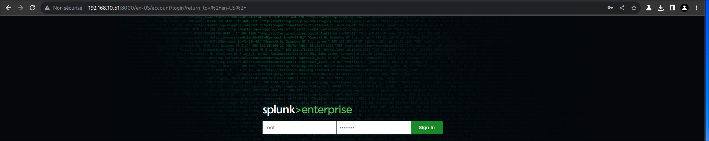
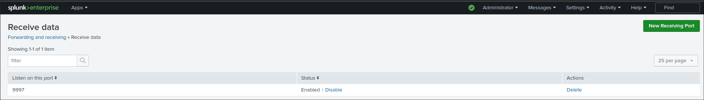
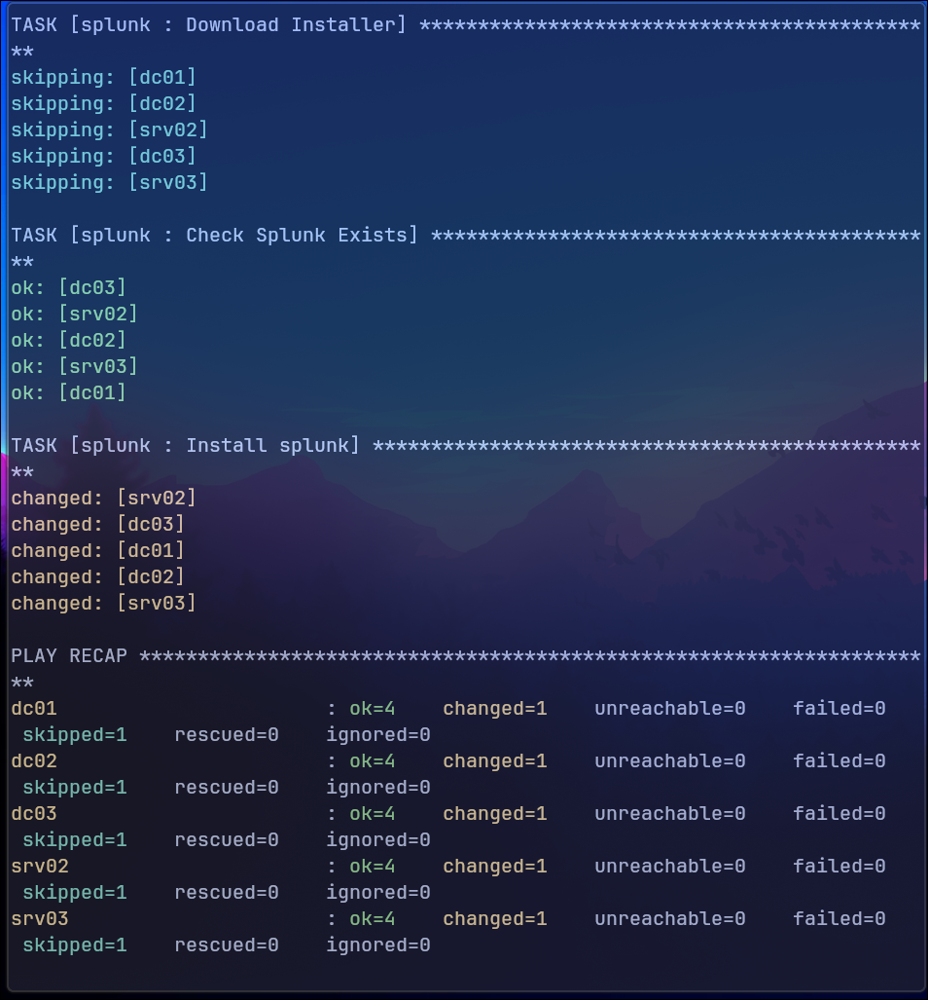
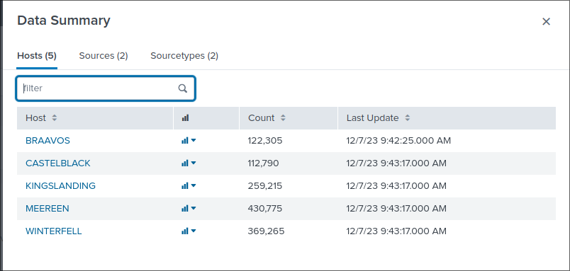
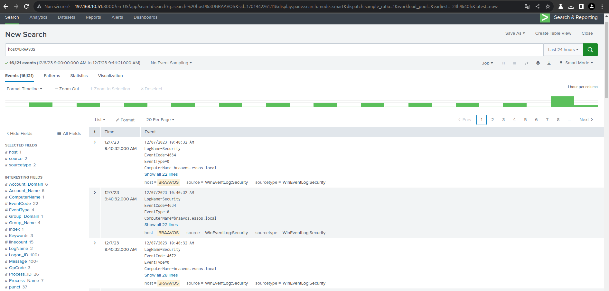

# Installation de Splunk

## 1. Installation du serveur

Dans un premier temps, il faut créer un compte sur le site de splunk afin de pouvoir télécharger la version d'essai de Splunk Enterprise.

Téléchargement de la version Enterprise:

```bash
wget -O splunk-9.1.2-b6b9c8185839-Linux-x86_64.tgz "https://download.splunk.com/products/splunk/releases/9.1.2/linux/splunk-9.1.2-b6b9c8185839-Linux-x86_64.tgz"
```

Extraction de l'archive:

```bash
root@splunk:~# tar xvf splunk-9.1.2-b6b9c8185839-Linux-x86_64.tgz
```

On déplace le dossier dans /opt puis on ajoute au PATH:

```bash
root@splunk:~# mv splunk /opt/splunk
root@splunk:~# export PATH=/opt/splunk/bin:$PATH >> .bashrc
root@splunk:~# source .bashrc
```

On peut démarrer maintenant démarrer splunk:

```bash
root@splunk:~# splunk start

Splunk> Take the sh out of IT.

Checking prerequisites...
 Checking http port [8000]: open
 Checking mgmt port [8089]: open
 Checking appserver port [127.0.0.1:8065]: open
 Checking kvstore port [8191]: open
 Checking configuration... Done.
 Checking critical directories... Done
 Checking indexes...
  Validated: _audit _configtracker _internal _introspection _metrics _metrics_rollup _telemetry _thefishbucket history main summary
 Done
 Checking filesystem compatibility...  Done
 Checking conf files for problems...
 Done
 Checking default conf files for edits...
 Validating installed files against hashes from '/opt/splunk/splunk-9.1.2-b6b9c8185839-linux-2.6-x86_64-manifest'
 All installed files intact.
 Done
All preliminary checks passed.

Starting splunk server daemon (splunkd)...  
PYTHONHTTPSVERIFY is set to 0 in splunk-launch.conf disabling certificate validation for the httplib and urllib libraries shipped with the embedded Python interpreter; must be set to "1" for increased security
Done


Waiting for web server at http://127.0.0.1:8000 to be available............... Done
```

Il faudra configurer le nom d'utilisateur et le mot de passe du compte administrateur.

Une fois lancer on se connecte sur l'interface Web.



### Configuration du Receiver

Afin de recevoir des logs depuis les machines Windows de GOAD qui seront forwarders, il faut activer un port sur lequels le serveur va recevoir des logs, le serveur sera un __receiver__.

On se rend dans __Settings > Forwarding and receiving__:

Puis dans l'onglet __Configure Receiving__



On ajoute un port en cliquant en haut à droite sur __New Receiving Port__.

Nous avons ajouté le port 9997 pour notre receiver.

## 2. Installer les forwarders

Une fois le serveur configuré, il faut installer l'agent sur les machines Windows. Pour cela, il faut télcharger l'Universal Forwarder sur les machines Windows:

### Installation Manuel

Téléchargement de l'installer:

```powershell
Invoke-WebRequest -Uri https://download.splunk.com/products/universalforwarder/releases/9.1.2/windows/splunkforwarder-9.1.2-b6b9c8185839-x64-release.msi -OutFile splunkforwarder-9.1.2-b6b9c8185839-x64-release.msi
```

Installation du forwarder avec la configuration du receiver:

```powershell
msiexec /i splunkforwarder-9.1.2-b6b9c8185839-x64-release.msi RECEIVING_INDEXER="192.168.10.51:9997" WINEVENTLOG_SEC_ENABLE=1 WINEVENTLOG_SYS_ENABLE=1 AGREETOLICENSE=Yes /quiet
```

Il faut faire la même chose sur les 5 serveurs. Pour cela nous avons décider de déployer les agents avec Ansible pour automatiser le déploiement.

### Installation avec Ansible

On a créer un playbook qui permet de télécharger l'installer, s'il n'a pas été deja télécharger puis de l'installer s'il n'est pas deja installer:

Inventaire:

```bash
[default]
; ------------------------------------------------
; sevenkingdoms.local
; ------------------------------------------------
dc01 ansible_host=192.168.10.10 dns_domain=dc01 dict_key=dc01
;ws01 ansible_host=192.168.10.30 dns_domain=dc01 dict_key=ws01
; ------------------------------------------------
; north.sevenkingdoms.local
; ------------------------------------------------
dc02 ansible_host=192.168.10.11 dns_domain=dc01 dict_key=dc02
srv02 ansible_host=192.168.10.22 dns_domain=dc02 dict_key=srv02
; ------------------------------------------------
; essos.local
; ------------------------------------------------
dc03 ansible_host=192.168.10.12 dns_domain=dc03 dict_key=dc03
srv03 ansible_host=192.168.10.23 dns_domain=dc03 dict_key=srv03


[all:vars]
; winrm connection (windows)
ansible_user=vagrant
ansible_password=vagrant
ansible_connection=winrm
ansible_winrm_server_cert_validation=ignore
ansible_winrm_operation_timeout_sec=400
ansible_winrm_read_timeout_sec=500
```

Le playbook est disponible en annexe dans le dossier ansible.

Je lance Ansible pour installer l'agent Splunk:

```bash
ansible-playbook -i inventory splunk.yml
```



Ansible s'execute sans erreur, l'agent à bien était installé.

## 3. Verification de l'installation

On se rend dans __Search & Reporting__ puis dans __Data Summary__, on peut voir que nos 5 serveurs remontent biens des logs:



On prent l'exemple de BRAAVOS on peut regarder les logs qu'il remonte:



On peut voir ici, des logs de sécurité Windows remonter.
